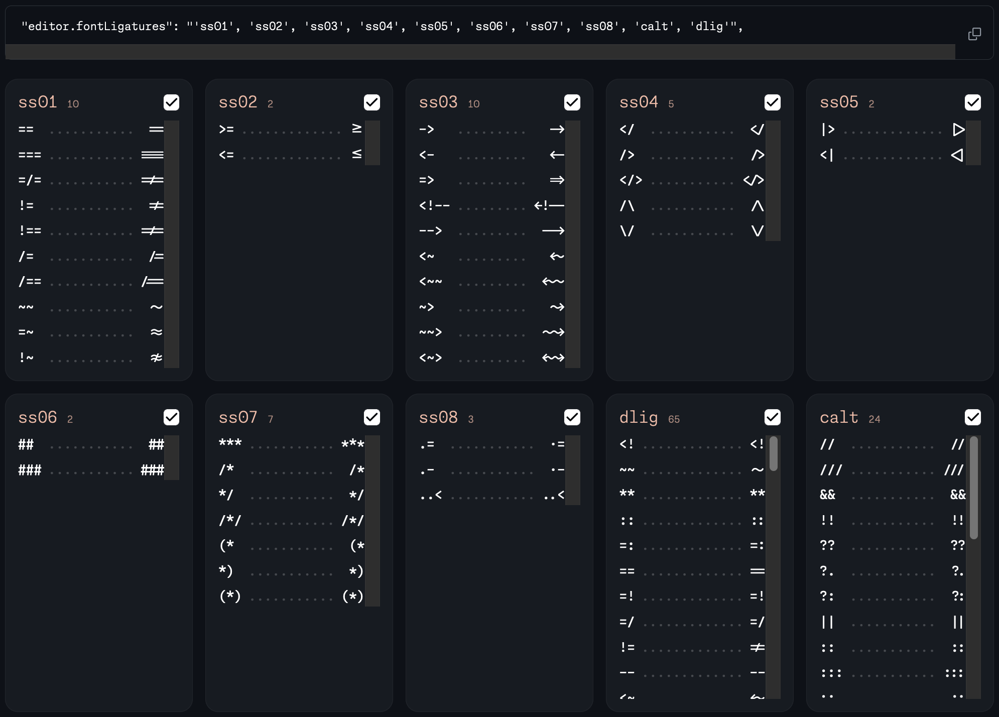
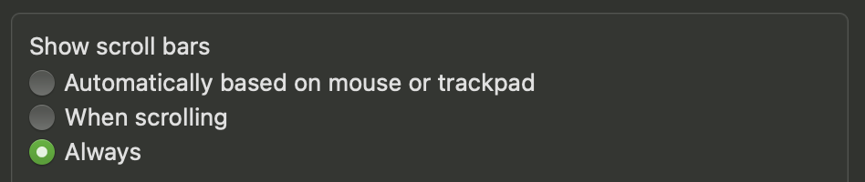

import { Link } from '@components/mdx/Link.tsx';
export const components = { a: Link };

This post is prompted by [the website for the new “monaspace” family of fonts](https://monaspace.githubnext.com/).

## The Problem

The problem there is the **`scroll`** value for any of the `overflow` properties. Don’t use it.

What you want to use instead in **99.9%** of cases is the **`auto`** value.

Here is a screenshot of the issues from the “monaspace” website:



In the above screenshot, there are only two blocks with actual scrollbars: on the bottom right, but every other similar element that does not have enough content for an overflow to happen still has a rectangle in the scrollbar’s place.

This is because the developers did use the `scroll` value, and did not test with the “Show scroll bars: Always” preference.

Here it is in the macOS “Appearance” System Settings tab:



The default value for macOS there is “Automatically based on mouse or trackpad”, making most of the scrollbars everywhere to have the “overlay” styles.

Changing this setting to “Always” makes it easy to spot this mistake. Highly recommend.

## The Solution

**Just use the `auto` value.**

## But What If…

Do you need to reserve some space for the scrollbar? Ok, maybe then you’re excempt from this rule! As with anything, if you know absolutely what you’re doing — go for it.

Though, in the future, I would recommend using the [`scrollbar-gutter`](https://drafts.csswg.org/css-overflow/#scrollbar-gutter-property) property with the `stable` value instead. Or, if you, for some reason, [don’t need Safari support](https://caniuse.com/?search=scrollbar-gutter), you can go ahead and use it now.

## Prevention

I did add this as a [Stylelint](https://stylelint.io/) rule to our codebase.

The rule I did chose for this is [`declaration-property-value-disallowed-list`](https://stylelint.io/user-guide/rules/declaration-property-value-disallowed-list/):

```js
{
	rules: {
		'declaration-property-value-disallowed-list': [
			{
				'/^overflow(-(x|y|inline|block))?$/i':
					/\bscroll\b/i,
			}
		]
	}
}
```

That’s it! If you’re using Stylelint — I recommend adding this rule yourself. If you’re not — I’ll strongly recommend starting using it, especially if you’re working in a team.
