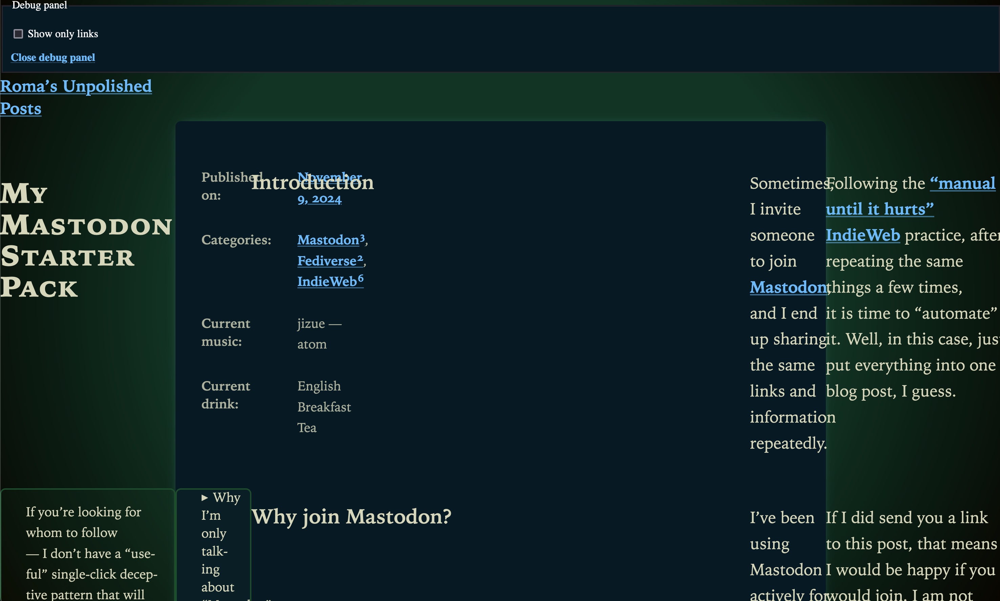

## Table of Contents

## The Problem

After I published my [“My Mastodon Starter Pack”](/my-mastodon-starter-pack/) post, it got boosted a bunch [in Mastodon](https://front-end.social/@kizu/113455328113049542). This led to more people trying to read it, and some — not successfully.

All because in this not very polished blog I used a lot of a bit too-modern CSS, for example, [native CSS nesting](https://drafts.csswg.org/css-nesting-1/). And — this resulted in the layout breaking quite substantially:



Yeah. This is what happens when non-frontend people arrive at your experimental site!

Well, I guess it is time to fix it!

## Lightning CSS

First thing I did is I added [Lightning CSS](https://lightningcss.dev/) to my blog (following [these instructions in Astro docs](https://docs.astro.build/en/guides/styling/#lightningcss)), so now its styles go through it. With the default settings, it does some [transpilation](https://lightningcss.dev/transpilation.html), including unwrapping native CSS nesting, the absence of which led to most of the problems.

After first adding it, I noticed that I don’t want to have _all_ the transpilation that it gives me: I'd better be a control freak in this case, and only add transpilation of native nesting, without, for example, transpiling `:is()` to `:-webkit-any()` and `:-moz-any()`. Here is the full part related to Lightning CSS in [my `astro.config.mjx`](https://github.com/kizu/kizu-blog/blob/main/astro.config.mjs):

```js
import { Features } from 'lightningcss';
// …
export default defineConfig({
	// …
	vite: {
		css: {
			transformer: "lightningcss",
			lightningcss: {
				targets: {},
				include: Features.Nesting,
			},
		},
	},
});
```

I already manually add fallbacks for non-oklch colors, and the rest seem to degrade much more gracefully, so, at least for now, this minimal config is all I need.

## Fixing Calculated Responsiveness

After testing how things look in Firefox 115, I still found that I need to adjust my responsive side notes and table of contents.

I’m using a bit too complex math for them, which involves many moving parts like [`round()`](https://drafts.csswg.org/css-values/#funcdef-round) and [`@property`](https://drafts.css-houdini.org/css-properties-values-api/#at-property-rule) (for [“Captured Custom Properties”](https://blog.kizu.dev/captured-custom-properties/)).

I added one `@supports` (targeting [`round()` support](https://developer.mozilla.org/en-US/docs/Web/CSS/round#browser_compatibility)) that sets some binary flags that I’m using for calculations to put these elements always inside the content area:

	```css
	@supports not (width: round(1px, 1px)) {
		--has-no-aside: 1;
		--has-aside: 0;
		--has-no-toc: 1;
		--has-toc: 0;
	}
	```

That’s it. There are probably still places that could be improved, with better fallbacks, but this should be good enough for now.

## Appreciating Feedback

I noticed that people are often reporting typos in my posts, and other issues — like this one.

Multiple people did let me know about it:

- [@Bahco@mastodon.nl](https://mastodon.nl/@Bahco) ([yesterday](https://mastodon.nl/@Bahco/113482537398179361)).
- [@Szescstopni@circumstances.run](https://circumstances.run/@Szescstopni) ([this Monday](https://circumstances.run/@Szescstopni/113461468020895552)).
- [@octothorpe@mastodon.online](https://mastodon.online/@octothorpe) ([back in August](https://mastodon.online/@octothorpe/112947627858007161)).

Thank you!

I always appreciate any feedback and bug reports, so, please, continue sending them my way. Some things could take a bit longer to fix, but, as you can see, repeated reports make it easier to prioritize more important fixes!

Do not be afraid to report something that you think is obvious or could’ve been reported before. Even if it was — you’ll give an additional signal that other people care, and that more people are affected. And if not, you could be the one reporting an awkward bug or typo that I missed.
